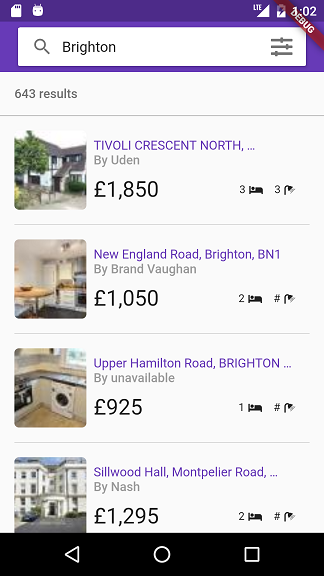
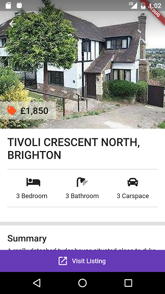

# Liberty House

A real estate listings app built using Flutter sdk. 

### What you'll learn
- JSON serialization using built_value
- State management using scoped_model
- Transforming JSON during decoding
- How to use Slivers
- Creating reusable UI widgets
- Building beautiful UIs
- and lots more

## Screenshots

 

## Getting Started

For help getting started with Flutter, view our online
[documentation](https://flutter.io/).
